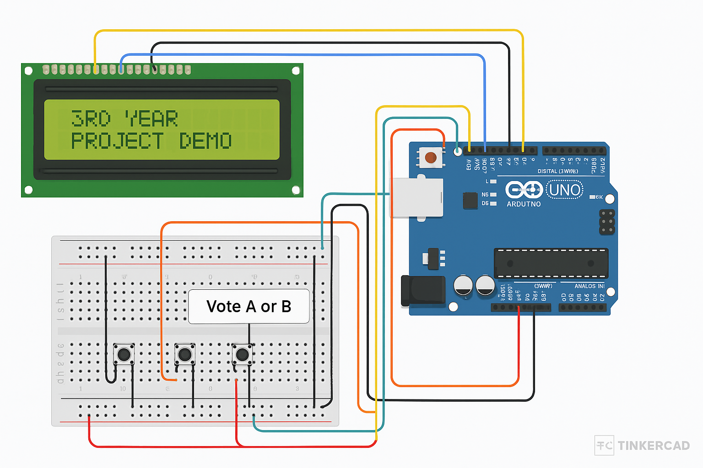

# Electronic Voting Machine (EVM) - Arduino Based

🎓 **Final Year Diploma Project**  
👨‍🔧 Developed by: Akshay Kumar , Pragati Tiwari , Annika , Shivalika.  
🏫 Sant Longowal Institute of Engineering and Technology, Department of Instrumentation.  
📅 Academic Year: 2024–2025

## 📘 Project Overview

This project is a prototype of an Electronic Voting Machine (EVM) designed using Arduino Uno, LCD display, and push buttons. It demonstrates secure vote casting, real-time result display, and automatic reset after each voting session.

## 🛠️ Technologies Used

- Arduino Uno
- LiquidCrystal LCD
- Embedded C++
- Push buttons, breadboard, resistors

## 📁 Project Contents

- `main.ino`: The complete Arduino source code
- `EVM_Project_Report.pdf`: Final project report (15 pages)
- `circuit_diagram.png`: Circuit connections of the components

## 👨‍👩‍👧‍👦 Team Members

- Akshay Kumar - Circuit Design, Coding, Documentation  
- Pragati tiwari and Shivalika  - Research, Testing  
- Annika - Debugging, LCD Interface

## 🔍 Project Features

- Vote for Candidate A or B
- View current result
- Auto-reset after each result cycle
- LCD interaction for user-friendly experience

## 🔌 Circuit Connections

### 1. 📺 LCD Display (16x2)

The LCD is used in **4-bit mode** and connected as follows:

| LCD Pin  | Connection                          |
|----------|--------------------------------------|
| RS       | Arduino Pin 7                        |
| E        | Arduino Pin 8                        |
| D4       | Arduino Pin 9                        |
| D5       | Arduino Pin 10                       |
| D6       | Arduino Pin 11                       |
| D7       | Arduino Pin 12                       |
| VSS      | GND                                  |
| VDD      | 5V                                   |
| V0       | Middle pin of 10kΩ potentiometer     |
| RW       | GND                                  |
| A (LED+) | 5V (via 220Ω resistor)               |
| K (LED-) | GND                                  |

> 📌 **Note:** Connect a 10kΩ potentiometer to control contrast via V0 pin.

---

### 2. 🔘 Push Buttons

Each button connects to the Arduino with **internal pull-up resistors**:

| Button        | Arduino Pin | Other Terminal |
|---------------|-------------|----------------|
| Button A      | Pin 2       | GND            |
| Button B      | Pin 3       | GND            |
| Result Button | Pin 4       | GND            |

> ⚙️ These buttons are configured as `INPUT_PULLUP` in the code, keeping them HIGH when unpressed and LOW when pressed.

---

### 3. 🎚️ Potentiometer (10kΩ)

Used to adjust LCD contrast:

| Potentiometer Pin | Connection |
|-------------------|------------|
| One End           | 5V         |
| Other End         | GND        |
| Middle Pin        | LCD V0     |

---

### 🖼️ Circuit Diagram

_(Tinkercad simulation of the actual project)_

---

## 📄 License

This project is open-source and free to use for academic and learning purposes.
